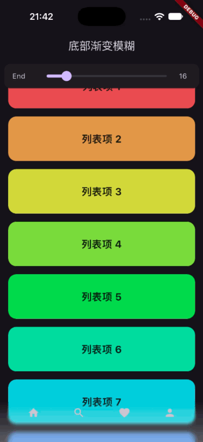

# progressive_background_blur

[](https://pub.dev/packages/progressive_background_blur)
[](https://github.com/LeoLi-Byte/progressive_background_blur/blob/main/LICENSE)

Language: [中文](README-ZH.md) | English

> A Flutter widget for **progressive (gradient / feathered) backdrop blur**, matching Figma's
> **Effects → Background blur → Progressive (Start / End)** effect. Pure Dart implementation
> powered by a fragment shader — no native code.

It works just like `BackdropFilter`: the widget blurs the scene content **behind** it (for example,
a scrolling list behind a navigation bar). The blur strength interpolates linearly from
`sigmaStart` to `sigmaEnd` along the line from `begin` to `end`, going top-to-bottom by default.

## Demo



The example app (`example/lib/main.dart`) with a bottom blur toolbar over a scrolling scene, tuning
the End sigma slider live. ▶ [Full-quality video](screenshots/example_video.mp4)

## Getting started

### Version constraints

```yaml
  sdk: ^3.11.0
  flutter: ">=3.41.0"
```

- **Impeller only.** Runtime support is detected through
  [`ui.ImageFilter.isShaderFilterSupported`](https://api.flutter.dev/flutter/dart-ui/ImageFilter/isShaderFilterSupported.html).
  Per-platform status (see the [Impeller docs](https://docs.flutter.dev/perf/impeller)):
  - **iOS**: Impeller is the only supported renderer, with no Skia fallback — always available;
  - **Android**: Impeller is enabled by default on API 29+. Devices on lower API levels or without
    Vulkan support fall back to the legacy OpenGL renderer, where `isShaderFilterSupported` is
    `false` and the widget renders `child` unchanged, following the graceful-degradation behavior
    below;
  - **macOS / Linux / Windows**: Impeller is enabled by default since Flutter 3.47. On Flutter
    3.41–3.46 these platforms still default to Skia, where the degradation behavior applies;
  - On any platform you can debug the degradation path with `flutter run --no-enable-impeller`.
- **Web is not supported.** On web, no blur is applied and `child` is rendered unchanged (when
  `child` is null, the widget becomes a zero-sized placeholder), following the graceful-degradation
  behavior below.

> **Graceful degradation**
>
> No blur is applied in any of these cases: `child` is rendered unchanged, or — when `child` is
> null — the widget takes up zero space, behaving like a childless `RenderProxyBox`:
>
> - Running on the Skia backend or on the web (`isShaderFilterSupported` is `false`).
> - The shader hasn't finished loading on the first frame.
> - Both `sigmaStart` and `sigmaEnd` are 0.

### Add the dependency

```yaml
dependencies:
  progressive_background_blur: ^0.0.4
```

```dart
import 'package:progressive_background_blur/progressive_background_blur.dart';
```

## Usage

### Precache the shader (recommended)

Call `ProgressiveBlur.precache()` before `runApp()` to precompile the shader and avoid an
unblurred first frame:

```dart
Future<void> main() async {
  WidgetsFlutterBinding.ensureInitialized();
  await ProgressiveBlur.precache();
  runApp(const MyApp());
}
```

> `precache()` is a no-op on unsupported platforms; the widget also loads the shader itself if
> you don't call it.

### Basic usage

The snippet below mirrors `example/lib/main.dart`: a scrolling list of colorful cards as the scene
behind, with a floating toolbar pinned to the bottom whose background is a progressive blur — crisp
at its top edge and increasingly blurred toward the bottom (`begin` at the top with sigma 0, `end`
at the bottom with the largest sigma). A white gradient tint and a row of icon buttons are painted
on top of the blur:

```dart
Scaffold(
  // The scene behind: a scrolling list of colorful cards.
  body: ListView.builder(
    itemCount: 40,
    itemBuilder: (BuildContext context, int index) {
      final Color color = HSVColor.fromAHSV(1, (index * 31) % 360, 0.6, 0.85).toColor();
      return Container(
        alignment: Alignment.center,
        decoration: BoxDecoration(color: color, borderRadius: BorderRadius.circular(16)),
        height: 88,
        margin: const EdgeInsets.symmetric(horizontal: 16, vertical: 8),
        child: Text('Background item ${index + 1}'),
      );
    },
  ),

  // The floating toolbar: ProgressiveBlur as its background.
  bottomNavigationBar: ProgressiveBlur(
    // Crisp at the top edge, blurriest at the bottom: sigma goes 0 → 16 along begin → end.
    begin: Alignment.topCenter,
    end: Alignment.bottomCenter,
    sigmaStart: 0,
    sigmaEnd: 16,
    // child is painted above the blur layer, usually holding a translucent
    // overlay, buttons, etc. It is optional; here it also gives the toolbar
    // its height. See "Blur without a child" below for the childless case.
    child: DecoratedBox(
      decoration: BoxDecoration(
        // Mimics the common gradient tint from Figma; the blur itself
        // comes from ProgressiveBlur.
        gradient: LinearGradient(
          begin: Alignment.topCenter,
          end: Alignment.bottomCenter,
          colors: <Color>[
            Colors.white.withValues(alpha: 0),
            Colors.white.withValues(alpha: 0.3),
          ],
        ),
      ),
      child: SafeArea(
        top: false,
        child: Row(
          mainAxisAlignment: MainAxisAlignment.spaceEvenly,
          children: <Widget>[
            IconButton(icon: const Icon(Icons.home), onPressed: () {}),
            IconButton(icon: const Icon(Icons.search), onPressed: () {}),
            IconButton(icon: const Icon(Icons.favorite), onPressed: () {}),
            IconButton(icon: const Icon(Icons.person), onPressed: () {}),
          ],
        ),
      ),
    ),
  ),

  // Lets the list scroll underneath the blur toolbar.
  extendBody: true,
)
```

> The full runnable demo lives in `example/lib/main.dart`: its top card hosts an **End** sigma
> slider (0–`ProgressiveBlur.maxSigma`), so you can tune the blur strength live.

### Custom gradient direction

`begin` / `end` define the alignment positions of the start and end points within the widget's own
bounds. The blur strength only transitions from `sigmaStart` to `sigmaEnd` along the line between
the two points. Four common setups:

```dart
// Top → bottom (the widget's own default; begin / end can be omitted).
// This is also the direction of the example app's bottom toolbar.
ProgressiveBlur(
  begin: Alignment.topCenter,
  end: Alignment.bottomCenter,
  sigmaStart: 0,
  sigmaEnd: 16,
  child: const SizedBox.expand(),
)

// Bottom → top.
ProgressiveBlur(
  begin: Alignment.bottomCenter,
  end: Alignment.topCenter,
  sigmaStart: 0,
  sigmaEnd: 4,
  child: const SizedBox.expand(),
)

// Left → right.
ProgressiveBlur(
  begin: Alignment.centerLeft,
  end: Alignment.centerRight,
  sigmaStart: 0,
  sigmaEnd: 16,
  child: const SizedBox.expand(),
)

// Top-left → bottom-right (diagonal gradient).
ProgressiveBlur(
  begin: Alignment.topLeft,
  end: Alignment.bottomRight,
  sigmaStart: 4,
  sigmaEnd: 24,
  child: const SizedBox.expand(),
)
```

You can also use `AlignmentDirectional` to mirror the gradient automatically in RTL text
direction:

```dart
ProgressiveBlur(
  begin: AlignmentDirectional.topStart,
  end: AlignmentDirectional.bottomEnd,
  sigmaStart: 0,
  sigmaEnd: 20,
  child: const SizedBox.expand(),
)
```

### Blur without a child

`child` is optional. When omitted, only the backdrop blur is painted — no foreground content — but
the widget must still get a size from its parent: under loose constraints a childless widget is
zero-sized, so use `Positioned.fill`, `SizedBox`, or another parent that supplies tight constraints:

```dart
Positioned.fill(
  child: ProgressiveBlur(
    sigmaStart: 0,
    sigmaEnd: 20,
  ),
)
```

## Parameters

| Name         | Type                | Default                  | Description                                                                                                                                                                                              |
|--------------|---------------------|--------------------------|----------------------------------------------------------------------------------------------------------------------------------------------------------------------------------------------------------|
| `begin`      | `AlignmentGeometry` | `Alignment.topCenter`    | Alignment of the gradient start point within the widget's bounds.                                                                                                                                        |
| `end`        | `AlignmentGeometry` | `Alignment.bottomCenter` | Alignment of the gradient end point within the widget's bounds.                                                                                                                                          |
| `sigmaStart` | `double`            | `0`                      | Gaussian blur sigma at the start point, corresponding to Figma **Start**. Passed to the shader as-is in backdrop-texture pixels (physical pixels). Clamped to 0–100 (inclusive), matching Figma's range. |
| `sigmaEnd`   | `double`            | required                 | Gaussian blur sigma at the end point, corresponding to Figma **End**. Same rules as `sigmaStart`.                                                                                                        |
| `child`      | `Widget?`           | `null`                   | The optional child painted above the blur layer. When null, the blur is still applied to the widget's own region (its size comes from the parent's constraints); only the foreground content is absent.  |

Static members:

| Name                             | Description                                                                                      |
|----------------------------------|--------------------------------------------------------------------------------------------------|
| `ProgressiveBlur.precache()`     | Precompiles and caches the shader program; recommended to `await` before `runApp()` in `main()`. |
| `ProgressiveBlur.shaderAssetKey` | The shader asset key (`lib/shaders/progressive_blur.frag`).                                      |
| `ProgressiveBlur.maxSigma`       | The upper bound for sigma, `100` (inclusive), matching Figma's range.                            |

## How it works

A fragment shader runs a two-pass (horizontal → vertical) separable Gaussian convolution, applied
to `BackdropFilter`'s full-screen backdrop snapshot through
[`ui.ImageFilter.shader`](https://api.flutter.dev/flutter/dart-ui/ImageFilter/ImageFilter.shader.html).
Per fragment, sigma is interpolated between `sigmaStart` and `sigmaEnd` by the fragment's position
along the `begin` → `end` line.

The blur is applied by the widget's own render object, which resolves the gradient's on-screen
position on every paint, writes it to the shader uniforms, and then pushes a
`BackdropFilterLayer` covering the widget's own region — so the blur moves, fades, and disposes
together with its page (for example during a route transition).

## Notes

- **Sigma cap**: inputs are clamped to 0–100 inclusive (`ProgressiveBlur.maxSigma`); due to the
  shader's 255-sample kernel limit, beyond a sigma of approximately 42 the actual blur strength
  stops increasing.
- **Translation-only animations may misalign**: the widget reads its on-screen position only once
  per paint. If it is moved by an outer widget that changes the position without triggering a
  repaint (`AnimatedSlide`, `FractionalTranslation`, or a layer-cached `Transform.translate`), the
  gradient band stays at the old position while the widget moves, so the two become misaligned. The
  app side needs to trigger repaints during such an animation.
- **No rotation / scale in outer widgets**: when an outer widget wrapping this one applies
  rotation, scale, or other non-translation transforms, the start / end point mapping no longer
  holds, so the gradient position can't be guaranteed.
- **Partially off-screen**: when the widget extends beyond the viewport, the gradient is remapped to
  the visible region (clipped at the edges), which differs slightly from Figma's "gradient across
  the widget's full size" semantics.
- **Performance**: every blurred region requires a backdrop snapshot and extra compositing cost, so
  avoid creating many instances frequently inside long lists.

> If you like my project, please click "Star" in the upper right corner of the project. Your
> support is my biggest encouragement! ^_^